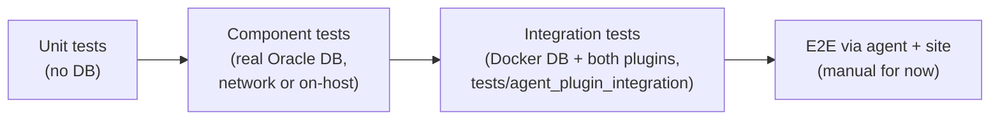

# mk-oracle Tests

Tests for the `mk-oracle` agent plugin, most of which drive a real Oracle database.
The suite is endpoint-driven: connection targets come from environment variables, not hard-coded hosts.
This document gives the overview and quick start; the details live in [`docs/`](docs/).

## Documentation

- [`docs/test-systems.md`](docs/test-systems.md) — inventory of the Oracle test systems (VMs, containers, build nodes): purpose, provisioning, ownership, credential pointers.
- [`docs/ci-jobs.md`](docs/ci-jobs.md) — which CI jobs exercise mk-oracle, triggered by which development stage (Gerrit CV, post-submit heavy chain, nightly build chain), against which systems.
- [`docs/endpoints.md`](docs/endpoints.md) — the endpoint model: `CI_ORA1_DB_TEST` / `CI_ORA2_DB_TEST`, the connection-string format, and how CI constructs endpoints from credentials.
- [`docs/windows-local-testing.md`](docs/windows-local-testing.md) — manual procedure for validating the **Windows** binary against a **locally installed** Oracle host over SSH, plus troubleshooting.

## Test tiers



- **Unit** — `bazel test //packages/mk-oracle:mk-oracle-lib-test-internal`; pure Rust, no database.
- **Component** — this directory's `test_ora_sql.rs` / `test_mk_oracle_bin.rs` against a real Oracle DB (see [`docs/test-systems.md`](docs/test-systems.md) for which one).
- **Integration** — `tests/agent_plugin_integration/` at the repo root: Dockerised Oracle Free, exercises the built plugin end-to-end including the legacy-vs-new comparison harness.
- **Perf / regression** — semi-automated local tiers under `perf/` and `regression/`.

## Layout

- `test_ora_sql.rs` — main integration suite; connects to every endpoint in `WORKING_ENDPOINTS` and exercises sections, discovery, PDB handling, and custom metrics.
- `test_mk_oracle_bin.rs` — drives the built binary end-to-end (CLI behaviour, agent output).
- `common/tools.rs` — helpers that build mini `Config`s from an endpoint and, on Windows, patch `PATH`/`TNS_ADMIN` to the bundled OCI runtime.
- `files/` — fixtures: `endpoints.txt`, TNS config under `tns/`, docker compose under `docker/`, and the `test-*.yml` configs.
- `perf/`, `regression/` — performance and regression fixtures.

## Running the tests

By default both flows connect **over the network** to the shared Rocky-Linux CI DB. The dedicated Windows job overrides the target to the Windows-native DB (see below).
How the target databases are selected is described in [`docs/endpoints.md`](docs/endpoints.md).

**Linux** — via Bazel:

```bash
bazel test //packages/mk-oracle:mk-oracle-lib-test-internal   # unit tests, no DB
bazel test //packages/mk-oracle:mk-oracle-lib-test-external   # component tests, needs a DB + OCI client
```

The component tests need the Oracle Instant Client staged under `runtimes/`; the package's `run` script orchestrates that and constructs `CI_ORA2_DB_TEST` for `oracle-rocky-ci.lan.checkmk.net` from `CI_ORA_TEST_PASSWORD`.

**Windows** — `run.ps1 --component-tests` builds the `x86_64-pc-windows-msvc` target and runs the suite.
By default it constructs `CI_ORA2_DB_TEST` for the Rocky DB from `CI_ORA_TEST_PASSWORD`, exactly as on Linux.
The `winagt-test-mk-oracle` job overrides `CI_ORA2_DB_TEST` to the Windows-native Oracle 23ai Free on `oracle-win-ci.lan.checkmk.net`, using its `CI_ORA_WIN_TEST_PASSWORD` credential — so that job exercises the Windows agent against a Windows-hosted DB while the shared build jobs keep using Rocky.

To exercise the host-local code paths on Windows (local `sysdba`/bequeath connections, registry discovery), see [`docs/windows-local-testing.md`](docs/windows-local-testing.md).

## Maintenance

The documents under `docs/` are the maintained overview of the Oracle test
infrastructure (CMK-36530, linked from epic
[CMK-33846](https://jira.lan.tribe29.com/browse/CMK-33846)). They only stay
useful if they stay current:

- Changing the CI wiring (Jenkins groovy under `buildscripts/scripts/`,
  `stages.yml`, the `run*` scripts here) → update
  [`docs/ci-jobs.md`](docs/ci-jobs.md) in the same change.
- Adding, retiring, or re-provisioning a test system (VMs, Docker images,
  build nodes) → update [`docs/test-systems.md`](docs/test-systems.md).
- Open questions are marked as `TODO` comments inside the documents — resolve
  them when the information becomes available rather than letting them age.
