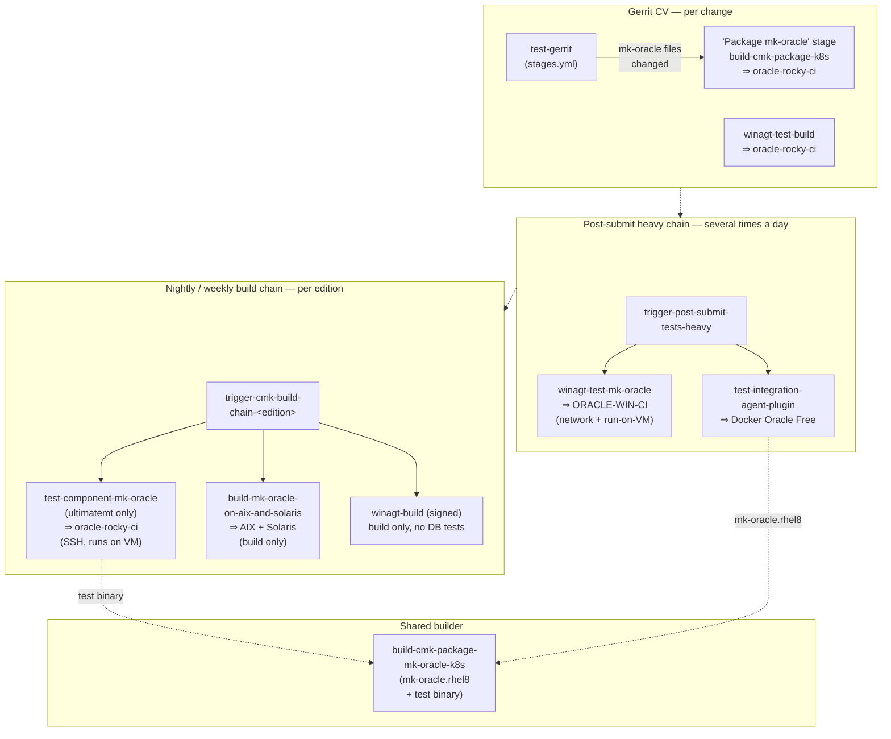

# Oracle CI jobs

Inventory of the automated jobs that build or test `mk-oracle`, organised by
the development stage that triggers them. Companion:
[`test-systems.md`](test-systems.md) describes the systems these jobs run
against.

All Jenkins paths below are relative to `checkmk/master/` on
`ci.lan.tribe29.com`. This document describes the **master** wiring; release
branches are wired similarly but reduced (master extends it).

## Trigger topology

Each job node names the system it tests against (`⇒ …`); the full job→system
mapping is in the tables below and the topology diagram in
[`test-systems.md`](test-systems.md). For readability the node labels omit the
Jenkins folder prefixes (`cv/`, `heavy/`, `builders/`) — the tables carry the
full job paths.

## Stage 1 — Gerrit CV (per change)

| Job / stage                                                                    | Definition                                               | Runs                                                                                                                                           | System                    | Credentials                                       |
| ------------------------------------------------------------------------------ | -------------------------------------------------------- | ---------------------------------------------------------------------------------------------------------------------------------------------- | ------------------------- | ------------------------------------------------- |
| `test-gerrit` → stage **Package mk-oracle** → `builders/build-cmk-package-k8s` | `buildscripts/scripts/stages.yml` + `test-gerrit.groovy` | `./run --component-tests` in the reference-image container                                                                                     | oracle-rocky-ci (network) | `CI_ORA_TEST_PASSWORD`, `CI_TEST_SQL_DB_ENDPOINT` |
| `cv/winagt-test-build`                                                         | `winagt-test-build.groovy` → `agents/wnx run.cmd --all`  | full Windows agent build **including** the mk-oracle test suite — unit + component tests (`Build-Package` without `--build` → `run.cmd --all`) | oracle-rocky-ci (network) | `CI_ORA_TEST_PASSWORD`, `CI_TEST_SQL_DB_ENDPOINT` |

The **Package mk-oracle** CV stage is conditional: `stages.yml` runs it only
when the change touches `packages/mk-oracle/`, top-level `packages/` files, the
Rust workspace, or the reference image (`ONLY_WHEN_NOT_EMPTY:
CHANGED_REFERENCE_IMAGE,CHANGED_MK_ORACLE_FILES,CHANGED_RUST_WORKSPACE_FILES`);
otherwise it is skipped with "No mk-oracle files changed".

`cv/winagt-test-build` is assumed to fire on changes to `packages/mk-oracle/`
(the authoritative trigger pattern lives in the Jenkins job-definition repo,
not in checkmk.git).

## Stage 2 — post-submit heavy chain (several times a day)

`trigger-post-submit-tests-heavy` fans out to the `heavy/` folder. The jobs
run with the heavy chain — observed several times a day (post-submit, not
nightly).

| Job                                   | Definition                             | Runs                                                                                                                                                                                                                            | System                                                                                                              | Credentials                                              |
| ------------------------------------- | -------------------------------------- | ------------------------------------------------------------------------------------------------------------------------------------------------------------------------------------------------------------------------------- | ------------------------------------------------------------------------------------------------------------------- | -------------------------------------------------------- |
| `heavy/winagt-test-mk-oracle`         | `winagt-test-mk-oracle.groovy`         | `run.cmd --component-tests` on a Windows build node                                                                                                                                                                             | ORACLE-WIN-CI: network stage (23ai Free over TCP) + run-on-VM local stage (test binary executed on the VM over SSH) | `CI_ORA_WIN_TEST_PASSWORD`, `jenkins-oracle-win-ssh-key` |
| `heavy/test-integration-agent-plugin` | `test-integration-agent-plugin.groovy` | `make test-integration-agent-plugin` — the pytest suite in `tests/agent_plugin_integration/` incl. the legacy-vs-new comparison test; consumes the `mk-oracle.rhel8` binary built by `builders/build-cmk-package-mk-oracle-k8s` | Docker Oracle Free (ephemeral, Docker-in-Docker)                                                                    | none (DB credentials are container-local)                |

## Stage 3 — nightly / weekly build chain (per edition)

`trigger-cmk-build-chain-<edition>` runs nightly by timer (weekdays = `daily`
use case, weekends = `weekly`), around 02:00–03:00.

| Job / stage                                   | Definition                                                                                                                                                            | Runs                                                                                                                                                                                                                                                             | System                           | Credentials                                                                                       |
| --------------------------------------------- | --------------------------------------------------------------------------------------------------------------------------------------------------------------------- | ---------------------------------------------------------------------------------------------------------------------------------------------------------------------------------------------------------------------------------------------------------------- | -------------------------------- | ------------------------------------------------------------------------------------------------- |
| `builders/test-component-mk-oracle`           | `test-component-mk-oracle.groovy` — chain stage "Component tests for mk-oracle", **ultimatemt edition only** (plugin is edition-independent, one run saves resources) | builds `test_ora_sql_test` via `builders/build-cmk-package-mk-oracle-k8s` (almalinux-8 Bazel), copies it to the Rocky VM over SSH, executes it **on** the VM (`run --remote-host`) — the Linux local-execution model                                             | oracle-rocky-ci (SSH + local DB) | `jenkins-oracle-ssh-key`, `CI_ORA_TEST_PASSWORD`, env `CI_ORA2_DB_TEST_SERVER`                    |
| `builders/build-mk-oracle-on-aix-and-solaris` | `build-mk-oracle-on-aix-and-solaris.groovy`                                                                                                                           | **build + unit tests** (`ssh-run-ci` runs `run -bu`; no DB-dependent tests), archives `mk-oracle.aix` / `mk-oracle.solaris`; post-build smoke tests are planned ([CMK-35442](https://jira.lan.tribe29.com/browse/CMK-35442))                                     | AIX + Solaris nodes (SSH)        | `jenkins-aix-build-ssh-key`, known-hosts files, `oracle_test_db_user_password` (unused for tests) |
| `winagt-build`                                | `winagt-build.groovy` → `run.cmd --all --skip-sql-test --sign…`                                                                                                       | signed Windows agent; mk-oracle is **built only** (`--skip-sql-test` → `run.cmd --build`: compile, no unit or DB tests — build/test separation per [CMK-30036](https://jira.lan.tribe29.com/browse/CMK-30036); the agent's own unit tests still run in this job) | —                                | `CI_ORA_TEST_PASSWORD` bound but unused for tests                                                 |
| `builders/build-cmk-package-mk-oracle-k8s`    | parameterised generic package job (`utils/package_helper.groovy`)                                                                                                     | produces the shipping Linux binary (`mk-oracle.rhel8`, via `bazel build mk-oracle` on almalinux-8) and, for test jobs, the external test binary `test_ora_sql_test`                                                                                              | build container                  | none                                                                                              |

Distro/package builds (`build-cmk-deliverables` etc.) consume the mk-oracle
artifacts via `package_helper.provide_agent_binaries` — build surface only, no
Oracle tests.

## Manual / dev-driven tooling (no CI job)

Package-local scripts that exercise the plugin against real databases on
demand; useful for reproducing CI behaviour or testing hosts CI does not
cover:

- [`../../deploy-run`](../../deploy-run) — builds a portable Linux binary
  (cargo-zigbuild, glibc 2.17 floor), copies it plus a variable-expanded YAML
  config to **any SSH-reachable Linux host**, and runs it there
  (`ORACLE_HOME`/`MK_LIBDIR` settable) — a de-facto integration test against a
  locally installed DB or a DB exposed by a container on that host. Linux
  remotes only.
- [`../../deploy-docker`](../../deploy-docker) — same idea, but deploys into a
  locally started Docker Oracle container
  ([`../files/docker/run-db.sh`](../files/docker/run-db.sh)).
- [`windows-local-testing.md`](windows-local-testing.md) — the run-on-VM model
  (`run.ps1 --remote-host`, also part of `winagt-test-mk-oracle`) plus its
  ad-hoc manual variant for debugging outside CI.
- [`../perf/`](../perf) — semi-automated performance comparison (Rust vs
  legacy) against a compose-managed Docker DB.

## Observed cadence snapshot (2026-07-22)

| Job                                           | Cadence                                      | Recent state |
| --------------------------------------------- | -------------------------------------------- | ------------ |
| CV "Package mk-oracle"                        | per change touching mk-oracle/Rust/ref-image | —            |
| `heavy/winagt-test-mk-oracle`                 | several/day (heavy chain)                    | green        |
| `heavy/test-integration-agent-plugin`         | several/day (heavy chain)                    | green        |
| `builders/test-component-mk-oracle`           | daily ~03:00 (+ on-demand re-runs)           | green        |
| `builders/build-mk-oracle-on-aix-and-solaris` | ~2/day (nightly chains + on demand)          | green        |
| `winagt-build`                                | several/day                                  | green        |

## Known gaps / TODO

- E2E (plugin → agent → site on a Checkmk site) — no automated CI job; a
  one-time manual pass is tracked in
  [CMK-36732](https://jira.lan.tribe29.com/browse/CMK-36732), automated E2E
  ([CMK-35441](https://jira.lan.tribe29.com/browse/CMK-35441)) is out of the
  current initiative.
- Multi-version DB matrix (19c / 12c) in CI — not active; the Docker
  integration suite is parametrised for it but only 23ai runs
  ([change 146352](https://review.lan.tribe29.com/c/check_mk/+/146352)).
- Perf tier — local semi-automated runs only, no CI job (accepted for 3.0).
