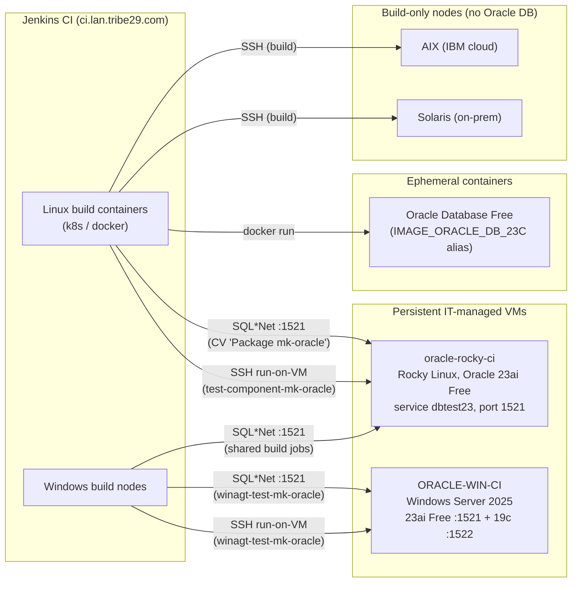

# Oracle test systems

Inventory of the systems the mk-oracle test infrastructure runs on: what each
system is for, how it is provisioned, how CI reaches it, who owns it, and where
the credentials live. Companion: [`ci-jobs.md`](ci-jobs.md) maps the CI jobs onto
these systems.

Scope note ([CMK-36530](https://jira.lan.tribe29.com/browse/CMK-36530)): this is
the infrastructure view of the _mk-oracle finalization_ test plan (epic
[CMK-33846](https://jira.lan.tribe29.com/browse/CMK-33846)). Keep it current —
see the Maintenance section in the [tests README](../README.md). The IT-managed
systems are also documented in the wiki under
[Test Environments](https://wiki.lan.checkmk.net/spaces/DEV/pages/149528955/Test+Environments).

## Topology

## `oracle-rocky-ci.lan.checkmk.net` — Linux reference DB

- **Purpose**: the shared reference database for all default component-test
  flows (Linux and Windows build nodes connect over the network), and the host
  the nightly Linux component-test job copies the test binary onto and runs it
  locally (covers the local-execution path on Linux).
- **Setup**: Rocky Linux VM with a native Oracle 23ai Free install.
  `ORACLE_HOME=/opt/oracle23/u01/app/oracle/dbhome1`. Connection constants
  (host, port `1521`, service `dbtest23`, SID `SID23`, user `system`) live in
  [`../../test-db-endpoints.conf`](../../test-db-endpoints.conf).
- **Provisioning**: persistent, IT-managed, re-provisioned via Ansible ("hard
  reference environment" per the test plan — kept for what Docker can't
  represent: full local-instance discovery, OS-specific paths). Wiki:
  [Linux — Oracle Test Environment with OracleDB 19c and 23AI](https://wiki.lan.checkmk.net/spaces/DEV/pages/171676250/Linux+-+Oracle+Test+Environment+with+OracleDB+19c+and+23AI).
- **Reachability**: SQL\*Net from Linux CI containers and Windows build nodes;
  SSH for the run-on-VM model (login user from the Jenkins SSH credential,
  home `/home/rocky`).
- **Credentials**: Jenkins secrets `CI_ORA_TEST_PASSWORD` (DB password) and
  `jenkins-oracle-ssh-key` (SSH). The Jenkins global env var
  `CI_ORA2_DB_TEST_SERVER` carries the host name for the component-test job.
- **Ownership / escalation**: IT manages the VM — reach out to IT when it
  breaks or needs re-provisioning; Team CI manages the Jenkins credentials and
  job wiring.

## `ORACLE-WIN-CI` (`oracle-win-ci.lan.checkmk.net`, 10.200.0.141) — Windows Oracle VM

- **Purpose**: Windows-native validation — the code paths a co-located agent
  uses that the network model never touches: local `sysdba`/bequeath
  connections, registry-based instance discovery (`HKLM\SOFTWARE\ORACLE`),
  NTFS-ACL permission checks. Two DB generations allow version-conditional
  logic checks.
- **Setup**: Windows Server 2025 (KVM VM), two **native** Oracle installs:
  - Oracle 23ai Free — listener port `1521`, CDB service `FREE`, PDB
    `FREEPDB1`, `ORACLE_HOME=C:\oracle\26ai\dbhomeFree`
  - Oracle 19c — listener port `1522`, services `orcl19` / `orcl19pdb`,
    SID `ORCL19`, `ORACLE_HOME=C:\Oracle19`
  - Both listeners bind the LAN address only — connect via hostname, never
    `localhost` (see [`windows-local-testing.md`](windows-local-testing.md)).
  - These details are a snapshot — the VM is re-provisioned via Ansible;
    re-verify after a reset. Wiki:
    [Win — Oracle Test Environment with OracleDB 19c and 23AI](https://wiki.lan.checkmk.net/spaces/DEV/pages/149528959/Win+-+Oracle+Test+Environment+with+OracleDB+19c+and+23AI).
- **Provisioning**: persistent, IT-managed (Ansible).
- **CI status**: both stages of the `winagt-test-mk-oracle` job are active —
  the **network model** (connects to the 23ai Free instance over TCP) and the
  **run-on-VM local model** (`run.ps1 --remote-host`: test binary shipped to
  and executed on the VM over SSH, covering local `sysdba` and registry
  discovery). Details and the ad-hoc manual variant:
  [`windows-local-testing.md`](windows-local-testing.md). CI-side provisioning
  was tracked in [CMK-36383](https://jira.lan.tribe29.com/browse/CMK-36383).
- **Credentials**: Jenkins secrets `CI_ORA_WIN_TEST_PASSWORD` (DB password)
  and `jenkins-oracle-win-ssh-key` (SSH login as `jenkins`).
- **Ownership / escalation**: IT owns and re-provisions the VM via Ansible —
  the current setup **including the CI public key and firewall rules is
  persisted** and survives a re-provisioning; any future on-VM changes must
  likewise be persisted by IT (reach out to IT). Team CI owns the Jenkins
  side.

## Docker — ephemeral Oracle containers

- **Integration suite** (`tests/agent_plugin_integration/` at the repo root):
  the `OracleDatabase` fixture starts an **Oracle Database Free** container per
  session, resolved through the image alias `IMAGE_ORACLE_DB_23C`
  (`buildscripts/docker_image_aliases/`, mirrored on
  `artifacts.lan.tribe29.com:4000`). Fully ephemeral and self-contained —
  wallet setup, credentials, and both old (`mk_oracle`) and new (`mk-oracle`)
  plugins are installed inside the container. Used for section/parsing tests
  and the legacy-vs-new comparison harness.
- **Local developer databases**:
  [`../files/docker/run-db.sh`](../files/docker/run-db.sh) starts a local
  Oracle container (versions 23 / 19 / 12 / 11) for ad-hoc development runs —
  not used by CI.
- **Perf tier** ([`../perf/`](../perf)): `docker-compose.yml` with
  `gvenzl/oracle-free:23.26.0` for the semi-automated performance comparison
  (Rust vs legacy plugin) — run locally, no CI job.
- **Ownership**: image aliases and registry mirror — Team CI; fixture code —
  Dev/QA via normal code review.

## AIX and Solaris — build-only nodes

- **Purpose**: prove the plugin **builds** (and, planned, smoke-runs) on AIX
  and Solaris. **No Oracle DB is installed** (licensing); DB-dependent tests
  stay excluded on these platforms
  ([CMK-35442](https://jira.lan.tribe29.com/browse/CMK-35442): automated
  post-build smoke / component tests without DB).
- **Systems** (connection defaults in [`../../ssh-run.conf`](../../ssh-run.conf)):
  - AIX — VM on IBM cloud (`161.156.22.86`), reached via SSH; exposed to the
    public internet, so DB experiments would require SSL tunnels (ports
    `6501`/`6502` are preconfigured in `ssh-run.conf`).
  - Solaris — on-prem bare metal (`solaris.dev.checkmk.net`).
- **Provisioning**: persistent, provisioned by IT.
  <!-- TODO: link the AIX/Solaris VM provisioning documentation here -->
- **Ownership**: Team IT and Main.
- **Credentials**: Jenkins `jenkins-aix-build-ssh-key` (SSH, both platforms),
  known-hosts files `know_hosts_ssh_aix` / `know_hosts_ssh_solaris`, and
  `oracle_test_db_user_password` (user/password pair, exported by the build
  job; no known consumer <!-- TODO: check whether anything still uses it -->).

## `oracle-win.dev.checkmk.net` — dev-only manual-testing host

The default `ORACLEDB_HOST` in [`../../ssh-run.conf`](../../ssh-run.conf),
predating the CI Oracle VMs. **Not part of any CI job** — used only by
developers for manual testing.

Probed 2026-07-22: DNS resolves (`10.200.3.14`), the host is alive and runs
Windows (OpenSSH for Windows on port 22), but no Oracle listener was answering
on 1521 (the port `ssh-run.conf` expects) or 1522 at that time — expect to
start the database / listener before manual use.

## Ownership summary

| System                          | Infrastructure owner | CI wiring                                                            | Escalation |
| ------------------------------- | -------------------- | -------------------------------------------------------------------- | ---------- |
| oracle-rocky-ci                 | IT                   | Team CI                                                              | IT         |
| ORACLE-WIN-CI                   | IT (Ansible)         | Team CI ([CMK-36383](https://jira.lan.tribe29.com/browse/CMK-36383)) | IT         |
| Docker images / registry mirror | Team CI              | Team CI                                                              | Team CI    |
| AIX / Solaris nodes             | Team Main + IT       | Team CI                                                              | IT         |

Credential pointers by design name only — the secrets themselves live in
Jenkins credentials (managed by Team CI). Never write secret values or full
connection strings into this repository.
